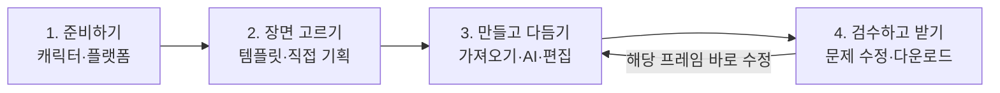

# 이모티콘 스튜디오 완성도·사용성 개선 기획

작성일: 2026-09-24 · 대상: `http://localhost:3002/admin/emoticon-studio`

> 후속 구현: 아래 내용은 변경 전 감사와 기획 기록이다. 1~4차 개선의 현재 구현 내용·검증 결과·남은 한계는 [구현 결과](./emoticon-studio-implementation-handoff.md)에 기록한다. 본문의 과거 코드 행 번호는 감사 시점 기준이다.

## 1. 제안의 핵심

**먼저 저장·복구·프레임 연결의 신뢰성을 확보하고, 그 위에 ‘다음에 무엇을 해야 하는지 바로 보이는’ 제작 흐름을 만든다.**

현재도 자동 저장, 단계 자유 이동, AI/수동 제작, 레이어 편집, 실행 취소, GIF 미리보기, 부분 ZIP, ZIP 복원이 구현돼 있다. 기능을 다시 만드는 것보다 이 기능들이 서로 같은 상태를 보여주고, 실패해도 작업을 잃지 않으며, 적은 조작으로 이어지는 데 집중한다.

주 사용자는 같은 캐릭터로 여러 장면의 움직이는 이모티콘을 만들고, 수정한 뒤 플랫폼별 작업 파일을 받으려는 제작자다. 기획의 기본 사용 범위는 개인 제작이며, 팀 협업·클라우드 동기화는 이번 1차 범위에서 제외한다.

이번 결과는 **실제 화면·코드를 조사한 개선 기획**이다. 앱 코드 수정, 배포, 유료 생성, 사용자 원본 변경은 수행하지 않았다.

## 2. 현재 확인된 문제와 우선순위

P0는 저장 내용·내보내기 대상의 신뢰성에 영향을 주어 먼저 해결할 항목, P1은 비용·실패 복구·핵심 사용성, P2는 이후 생산성 개선이다. 표의 ‘재현’은 실제 원문 함수를 분리해 메모리에서 실행한 결과이며, 브라우저의 사용자 저장 데이터를 조작한 결과가 아니다.

### A. 원문 함수 실행으로 재현한 결함

| 순위 | 문제와 발생 조건 | 사용자 영향 | 개선과 완료 기준 |
|---|---|---|---|
| P0 | 24장면 × 2프레임 프로젝트를 복구하면 선택 장면이 **24 → 12**로 감소한다. | 원본 이미지가 즉시 삭제되는 것은 아니지만 선택에서 빠진 장면은 다음 내보내기 대상에서 제외될 수 있다. | 장면 수·전체 프레임 수 제한을 저장/편집/복원에서 통일. 24장면·48프레임 왕복 후 선택·연결·내보내기 대상이 일치해야 한다. |
| P0 | 같은 장면의 1번 이미지를 2번 프레임에 다시 연결해도 기존 `keyframeId`가 남는다. 복구 시 index **1 → 0**으로 돌아온다. | 드롭다운 선택과 제작 진행률·재생성 대상이 달라질 수 있다. | `sceneId`, `keyframeId`, `keyframeIndex`를 함께 갱신. 미지정 시 모두 비움. 화면·저장·복구·재생성 대상 일치. |
| P0 | 기획 슬롯 함수가 먼저 48개로 잘라 반환한다. 이후 ‘48개 초과’ 검사는 실제 **49개 → 표시 48개**, 초과 판정 `false`가 된다. | 프리셋을 확장해도 저장이 성공한 것처럼 보이면서 뒤쪽 작업이 제작 목록에서 빠진다. | 전체 합계를 먼저 검사. ‘1프레임 초과: 장면을 나누거나 프레임을 줄여 주세요’로 안내. 조용히 잘라내지 않는다. |
| P1 | 기본 회전 발차기의 **80/90ms가 복구 시 100ms**로 바뀐다. | 다시 열거나 ZIP 복원한 뒤 동작의 리듬·속도가 달라진다. | 기본값·입력·가져오기·저장의 허용 범위를 통일. 지원하는 시간값은 정확히 보존하고, 비지원 값은 가져오기 전에 명시적으로 안내. |

근거는 모두 [SemiAutoEmoticonStudio.tsx](C:/Users/playz/propig/src/app/admin/emoticon-studio/SemiAutoEmoticonStudio.tsx)다.

- 장면 복구 제한: [302행](C:/Users/playz/propig/src/app/admin/emoticon-studio/SemiAutoEmoticonStudio.tsx:302), 선택 장면 기반 내보내기: [1198행](C:/Users/playz/propig/src/app/admin/emoticon-studio/SemiAutoEmoticonStudio.tsx:1198).
- 수동 연결: [2741행](C:/Users/playz/propig/src/app/admin/emoticon-studio/SemiAutoEmoticonStudio.tsx:2741), 갱신 타입: [1812행](C:/Users/playz/propig/src/app/admin/emoticon-studio/SemiAutoEmoticonStudio.tsx:1812), 복구 시 ID 우선 처리: [319행](C:/Users/playz/propig/src/app/admin/emoticon-studio/SemiAutoEmoticonStudio.tsx:319).
- 슬롯 잘라내기: [437행](C:/Users/playz/propig/src/app/admin/emoticon-studio/SemiAutoEmoticonStudio.tsx:437), 초과 검사: [1414행](C:/Users/playz/propig/src/app/admin/emoticon-studio/SemiAutoEmoticonStudio.tsx:1414).
- 재생 시간 보정: [284행](C:/Users/playz/propig/src/app/admin/emoticon-studio/SemiAutoEmoticonStudio.tsx:284), [331행](C:/Users/playz/propig/src/app/admin/emoticon-studio/SemiAutoEmoticonStudio.tsx:331).

### B. 코드에서 확인한 실패 복구·상태 표시 문제

| 순위 | 확인한 흐름 | 기획 요구사항 |
|---|---|---|
| P1 | 같은 함수 안의 즉시 재시도는 동일 요청 ID를 쓰지만, 취소/응답 유실 후 ‘이어 생성’은 새 요청 ID를 발급한다. | 프레임별 요청 ID를 먼저 저장한다. 이어가기는 기존 처리 결과 확인 → 완료 결과 복구 → 확정 실패만 새 생성 순서로 진행한다. 결과 불명 상태를 곧바로 실패로 처리하지 않는다. |
| P1 | 서버는 선택 모델을 사용할 수 없을 때 다른 모델로 대체할 수 있고, 화면은 실제 사용 모델을 읽지 않는다. | 명시 선택 모델이 불가하면 대체 후보와 차이를 제시한다. 자동 모드도 실행할 모델·품질·수량을 먼저 확정하고 결과에 실제 모델을 남긴다. |
| P1 | 저장 실패는 알림을 띄우지만 이전 `savedAt`을 지우지 않아 ‘자동 저장됨’ 표시가 남을 수 있다. 복구 실패도 종료 후 준비 완료로 넘어간다. | 저장 상태를 `복구 중 / 변경 있음 / 저장 중 / 저장됨 / 저장 실패`로 구분한다. 복구 실패를 빈 프로젝트와 구별하고 다시 시도·백업 동작을 제공한다. |
| P1 | 세션 비용은 성공한 이미지 응답의 숫자 비용만 누적한다. 기획·비용 미확정·새로고침은 반영되지 않는다. | ‘확정된 비용 / 확인 중인 요청 / 남은 예산’을 구분한다. 알 수 없는 비용을 0원으로 표시하지 않는다. 최소 수정 시 ‘이번 화면에서 확인된 이미지 비용’으로 명칭을 정확히 바꾼다. |
| P1 | 모델 정보 조회의 HTTP 오류·연결 실패를 무시해 ‘확인 중’이 계속 남을 수 있다. | 로그인 필요·권한 없음·미설정·연결 실패·사용 가능을 구별하고 ‘다시 확인’ 또는 해당 설정 화면으로 연결한다. |

이 항목들은 코드 경로를 확인한 결과다. 실제 과금 중복, 공급자 장애, 저장소 용량 초과를 실계정에서 발생시키지는 않았다.

근거:

- 요청 ID 생성·응답 처리: [1597행](C:/Users/playz/propig/src/app/admin/emoticon-studio/SemiAutoEmoticonStudio.tsx:1597). 서버에는 [동일 요청의 완료 결과 복구](C:/Users/playz/propig/src/app/api/generate-image/route.ts:146)가 이미 있으므로 이를 이용하는 방향이 적절하다.
- 모델 대체: [generate-image/route.ts:489](C:/Users/playz/propig/src/app/api/generate-image/route.ts:489), 실제 응답을 비용만 읽는 곳: [1624행](C:/Users/playz/propig/src/app/admin/emoticon-studio/SemiAutoEmoticonStudio.tsx:1624).
- 저장 처리: [1145행](C:/Users/playz/propig/src/app/admin/emoticon-studio/SemiAutoEmoticonStudio.tsx:1145), 저장 표시·비용 표시: [2508행](C:/Users/playz/propig/src/app/admin/emoticon-studio/SemiAutoEmoticonStudio.tsx:2508).
- 기획 응답: [plan/route.ts:181](C:/Users/playz/propig/src/app/api/emoticon-studio/plan/route.ts:181), 모델 조회 실패: [1176행](C:/Users/playz/propig/src/app/admin/emoticon-studio/SemiAutoEmoticonStudio.tsx:1176).

### C. 실제 화면에서 확인한 사용성 문제

| 관찰 | 개선 방향 |
|---|---|
| 프로젝트 이름·플랫폼 설정과 제작 설명이 여러 단계에 반복된다. | 초기 설정에서 한 번 결정하고 상단 요약에서 바꾼다. 설정을 바꾸면 영향을 받는 결과를 안내한다. |
| 기획 단계의 다음 버튼은 ‘ChatGPT에서 프레임 만들기’인데 실제로는 내부 이미지 제작 단계로 이동한다. | ‘이미지 만들기’로 바꾸고, 외부 ChatGPT 링크는 별도의 분명한 동작으로 둔다. |
| 수동 안내와 API 설정이 한 화면에 길게 나열된다. 기술 문구인 catalog, schema, manifest, Worker도 기본 흐름에 노출된다. | ‘직접 가져오기 / AI로 만들기’를 먼저 선택. 선택한 방식만 펼치고 기술 정보는 상세 정보로 이동한다. |
| 390×844 모바일의 이미지 제작 단계에서 자동 생성 버튼은 약 y=1,037px, 파일 선택 버튼은 y=1,902px, 편집 버튼은 y=2,416px에 있다. | 현재 방식의 주요 버튼을 첫 화면에 배치하고, 하단에 현재 가능한 주 작업 하나를 고정한다. 상세 설명은 접는다. |
| 모바일에서는 저장 상태가 숨겨진다. 데스크톱 4단계에서 모바일로 전환하면 현재 단계 버튼이 가로 스크롤 밖에 있다. | 저장 상태를 작은 한 줄로 유지. 단계 안내는 별도 행으로 옮기고 현재 단계를 자동으로 보이게 한다. |
| 이미지가 없는 내보내기 화면에 빈 상태 안내와 함께 비활성 버튼·결과 설명이 길게 보인다. | 빈 상태에는 ‘이미지 가져오기’, ‘백업 불러오기’를 우선. 결과가 생긴 뒤 검수 항목과 다운로드 도구를 노출한다. |
| 생성 버튼 비활성화는 상황별 필요한 준비를 직접 설명하지 않는다. | 버튼 옆에 ‘기준 이미지가 필요해요 → 이미지 선택’처럼 원인과 해결 동작을 함께 표시한다. |

가로 스크롤이 있는 단계/프레임 목록은 의도된 내부 스크롤이다. 측정한 모바일 화면의 문서 너비는 390px로, 페이지 전체 가로 넘침은 확인되지 않았다. 이 관찰을 ‘모바일 전체 레이아웃이 깨짐’으로 확대 해석하지 않는다.

### D. 추가 재현이 필요한 후보

GIF/WebP 처리 중 레이어·플랫폼·프로젝트가 바뀌면 과거 결과가 최신 미리보기로 다시 붙을 가능성이 있다. 편집 시 기존 결과를 지우는 처리는 있지만 완료 응답의 프로젝트·수정 버전 일치를 확인하지 않는다. [2063행](C:/Users/playz/propig/src/app/admin/emoticon-studio/SemiAutoEmoticonStudio.tsx:2063) 및 [2107행](C:/Users/playz/propig/src/app/admin/emoticon-studio/SemiAutoEmoticonStudio.tsx:2107).

지연된 인코딩/변환 응답을 이용해 먼저 재현한다. 확인되면 `projectId + revision + runId`가 현재 작업과 일치하는 결과만 적용한다. 이 후보를 실사용에서 재현한 버그로 보고하지 않는다.

## 3. 제안하는 화면 구조

기존 6단계의 기능을 다음 4개 작업 공간으로 묶는다. 순서를 강제하지 않으며, 이미지가 이미 있는 사용자는 바로 가져오기부터 시작할 수 있다.

| 작업 공간 | 기본 화면·주 동작 | 펼쳐서 쓰는 기능 |
|---|---|---|
| 준비하기 | 캐릭터 이미지, 이름, 플랫폼. 주 버튼 ‘장면 고르기’. 프로젝트 이름은 캐릭터 이름으로 제안한다. | 특징 설명, 프로젝트 이름 변경, 규격 상세, ZIP 불러오기 |
| 장면 고르기 | 선택한 장면과 총 프레임 수. 주 버튼 ‘이 장면으로 만들기’. 기본 템플릿은 동작 썸네일과 짧은 이름으로 표시한다. | 프레임별 자세·시간·말풍선, 직접 연출, AI 기획, JSON 가져오기 |
| 만들고 다듬기 | 장면 목록, 프레임 보드, 선택 프레임 미리보기. ‘파일 가져오기 / AI로 만들기’ 선택 후 주 동작 하나. | 모델·품질·수량, 레이어, 숫자 좌표, 개별 프롬프트 |
| 검수하고 받기 | 실제 장면별 재생, 오류 목록, 수정 위치로 가기. ‘작업 백업 받기’와 ‘플랫폼 결과 받기’를 분명히 구분한다. | 파일 목록, 규격 기준 날짜·공식 링크, 상세 검사 결과 |

### 항상 보이는 정보

- 상단: 프로젝트 이름, 현재 플랫폼, 저장 상태, 백업 메뉴.
- 제작 중: ‘6프레임 중 4개 완료 · 1개 확인 중 · 1개 미생성’처럼 실제 상태 표시.
- 유료 실행 직전: 실행 모델, 품질, 수량, 전송 대상, 확인 가능한 비용/상한과 미확정 여부.
- 모바일: 현재 단계, 저장 상태, 현재 가능한 주 작업 버튼. 고정 영역이 입력칸이나 키보드 포커스를 가리지 않도록 여백과 키보드 표시 상태를 고려한다.

### 처음 사용하는 사람의 빠른 경로

`캐릭터 선택 → 인사 템플릿 선택 → 이미지 가져오기 또는 AI 생성 → 재생 확인 → 다운로드`

프레임·레이어·JSON을 몰라도 이 경로를 끝낼 수 있어야 한다. 기존 숙련 사용자의 개별 프레임 편집, 자유 이동, 수동 제작과 부분 백업은 그대로 제공한다.

## 4. 예외 상황을 제품 동작으로 정의

| 상황 | 사용자에게 보일 상태 | 가능한 다음 동작 |
|---|---|---|
| 이미지/이름 등 준비 부족 | ‘기준 이미지를 먼저 선택해 주세요’ | 해당 입력으로 이동 |
| 복구 중 이미지 없음 | ‘저장한 원본 확인 중’ | 복구가 끝날 때까지 해당 작업의 실행만 보류 |
| 저장 실패·용량 부족 | ‘이 기기에 저장하지 못했어요’ | 재시도, 가능한 원본을 포함한 백업 받기 |
| 요청 전 로그인/권한/연결 오류 | 원인별 안내 | 로그인, 권한 안내, 연결 다시 확인 |
| 서버 접수 후 응답 유실 | ‘결과 확인 중’ | 동일 작업 조회, 확인 완료 후 결과 복구 |
| 생성 취소 | ‘추가 생성 중지됨 · 이미 전송한 작업 확인 중’ | 도착한 결과 보관, 다음 작업 재개 |
| 여러 장 중 일부 실패 | 성공한 프레임 유지, 실패 위치·이유 표시 | 실패 확정 항목만 다시 시도 |
| 선택 모델 사용 불가 | ‘선택한 모델을 사용할 수 없어요’ | 대체 후보를 직접 선택하거나 파일 가져오기 |
| 잘못된 이미지/손상 ZIP | 파일명과 실패 이유 | 기존 프로젝트 유지, 올바른 파일 다시 선택 |
| 프레임 상한 초과 | 실제 합계와 초과 수 표시 | 다른 장면 해제, 장면 나누기, 변경 취소 |
| 작업 중 새 프로젝트 | 현재 프로젝트 저장 상태·보관 선택 | 백업 후 시작 또는 취소. 일반 ‘새 프로젝트’를 기존 원본 삭제와 분리 |
| 규격 미충족 | 오류·경고·미검사 구분 | 해당 프레임 수정. 작업 백업은 가능하되 제출 가능 상태로 표시하지 않음 |

알림은 잠깐 뜨는 메시지에만 의존하지 않는다. 저장 실패, 결과 확인 중, 과금 미확정은 해결될 때까지 작업 공간에 남긴다.

## 5. 변수·상태와 구현 구조 개선안

약 3천 줄의 단일 파일을 외형만 나누는 작업부터 시작하지 않는다. 먼저 아래 계약을 확정하고, 결함을 검증하는 작은 검사와 함께 상태 경계를 분리한다.

| 현재 문제 | 제안하는 정리 |
|---|---|
| `keyframeId`와 `keyframeIndex`가 독립적으로 변경됨 | ID를 연결의 기준으로 삼고 index는 표시 순서에서 계산. 구형 ZIP은 명시적인 변환 과정으로 처리. |
| `draft.frameMeta`와 `frames`에 편집 상태가 중복됨 | 편집 데이터의 단일 기준을 정하고 `File`·URL은 자산 저장소로 분리. 중간 단계에서는 연결 변경을 한 함수로 통합. |
| 복구 단계에서 여러 상한을 조용히 적용 | 공통 제한값과 버전별 검증 사용. 사용자 데이터 축소는 경고와 복구 경로 없이 수행하지 않음. |
| `savedAt` 존재만으로 저장 성공 판단 | 수정 버전과 저장된 버전을 비교하는 `saveStatus` 사용. 시간은 성공 상태의 부가 정보. |
| `generationStates`에 라벨·간단한 상태만 존재 | 장면 ID, 프레임 ID, 요청 ID, 요청 내용 식별값, 실제 모델, 비용 상태, 결과 위치를 보관. 원문 비밀정보는 기록하지 않음. |
| `step`만 화면 내부에 존재 | 단계/선택 장면의 복원·뒤로가기를 지원하되 외부 URL에 프롬프트·이미지·개인정보를 넣지 않음. |
| 여러 비동기 플래그가 결과의 유효성을 보장하지 못함 | 처리 종류별 상태와 `projectId/revision/runId`를 통해 오래된 결과 적용 차단. |

제안 분리 단위는 프로젝트 저장·복구, 기획/프레임 연결, 생성 작업 관리, 합성/내보내기, 화면이다. 실제 파일명은 구현 직전 기존 디렉터리와 호출 관계를 확인해 정하며 package/lockfile 변경은 우선 필요하지 않다.

## 6. 실행 순서와 완료 기준

### 1차 — 작업 신뢰성 확보

범위: 선택 장면 손실, 프레임 연결 불일치, 48프레임 검증, 시간값 보존, 정확한 저장 상태.

완료 기준:

- 24장면·48프레임의 저장→새로고침→ZIP 내보내기→복원 후 의미 있는 데이터가 동일하다.
- 연결을 1번→2번→미지정으로 바꿨을 때 진행률·편집·저장·복구가 모두 일치한다.
- 47/48/49개 경계에서 누락 없이 허용/초과 동작이 분명하다.
- 지원 시간값은 원본 그대로 유지되며 저장 실패 중에는 ‘저장됨’이 보이지 않는다.

### 2차 — 제작 동선 단순화

범위: 4개 작업 공간, 수동/AI 방식 선택, 중복 안내 제거, 비활성 이유, 모바일 주 동작.

완료 기준:

- 390×844와 1365×900에서 현재 단계·저장 상태를 확인할 수 있다.
- 이미지 제작의 첫 화면에서 선택한 방식의 시작 버튼을 찾을 수 있다.
- 외부 서비스 열기와 내부 다음 단계 이동이 이름·아이콘·동작에서 일치한다.
- 키보드로 이동·입력·장면 선택·편집·닫기가 가능하고 포커스가 고정 UI에 가려지지 않는다.
- 기존 자유 이동, 수동 가져오기, 부분 ZIP, 실행 취소 기능이 유지된다.

### 3차 — 실패해도 이어지는 AI 작업

범위: 요청 복구, 실제 모델 확정, 비용 미확정 표시, 연결 실패/권한 상태, 비동기 미리보기 후보 재현 및 수정.

완료 기준:

- 테스트용 지연·실패 응답으로 새로고침/취소/응답 유실 후 같은 유료 작업을 중복 제출하지 않음을 확인한다.
- 실제 실행 모델이 요약과 일치하거나, 변경을 실행 전에 사용자가 알 수 있다.
- 비용 정보가 없을 때 0으로 오인하지 않게 표시한다.
- 이전 프로젝트/이전 편집 버전의 늦은 응답이 최신 결과에 섞이지 않는다.

### 4차 — 반복 작업 속도 향상

앞선 기준을 통과한 후 장면 검색, 최근 템플릿, 여러 프레임 시간 일괄 변경, 실패 항목 필터, 장면별 미리보기와 검수 바로가기를 추가한다. 다중 프로젝트 보관은 저장 구조와 기존 데이터 이동을 별도 설계한 뒤 진행한다.

효과 측정은 새 UI 적용 전후 같은 작업으로 비교한다. 수동 경로에서 첫 프레임 반입까지 걸린 시간, 불필요한 스크롤/단계 이동 수, 실패 후 재작업한 프레임 수를 우선 본다. ‘30% 단축’ 같은 수치는 현재 측정 근거가 없으므로 목표치로도 임의 확정하지 않는다.

## 7. 검증·근거·한계

실제 수행:

- 현재 branch와 기존 dirty 변경을 읽고 보존했다. Hermes 구조 검사와 admin/security 읽기 전용 병렬 범위 검사 통과. 수정 owner는 lead이며 허용 산출물은 이 문서 하나다.
- 실제 브라우저에서 프로젝트, 캐릭터, 기획, AI 기획 패널, 이미지 제작, 검수·내보내기 화면을 열었다. 데스크톱 1365×900, 모바일 390×844를 확인했다.
- 모바일에서 문서 가로 넘침 없음, 저장 표시 숨김, 주요 버튼 위치를 DOM으로 측정했다. 조회 당시 수집된 경고/오류 로그는 없었다. 전체 시나리오 무오류를 의미하지 않는다.
- `node scripts/verify-semi-auto-emoticon-studio.mjs`: exit 0, `Semi-auto Emoticon Studio UI contracts passed.`
- 실제 TSX의 필요한 선언만 AST로 추출하고 TypeScript로 변환해 메모리에서 실행했다. lead가 독립 실행한 결과: 선택 장면 24→12, 시간 80/90→100ms, 재연결 index 1→0, 실제 49프레임→목록 48개·초과 판정 false.

기존 정적 검사 PASS는 코드 존재 계약의 통과다. 저장 왕복의 의미, 수동 연결의 일치, 실패 후 과금 요청 재사용까지 보장하지 않는다. 구현 때 위 재현을 회귀 검사로 전환해야 한다.

실행하지 않은 검증:

- 실제 AI 유료 생성·과금, 운영 데이터 쓰기, 실제 이미지 업로드·내보내기 전 과정.
- 인증 역할별 실계정 시험, 저장소 용량 초과, 여러 탭 동시 편집, GIF/WebP 지연 응답 재현.
- 전체 type/lint/build와 브라우저 complete gate. 앱 코드를 수정하지 않은 기획 감사이므로 실행하지 않았다.
- 각 플랫폼의 최신 제출 규격 재검증. 화면의 기준 날짜가 표시되는 것은 확인했지만 현재 공식 규격을 인증한 것은 아니다. 구현 시 공식 자료와 버전·검사 기준을 함께 갱신해야 한다.

접근성·인터랙션 검토에는 [Vercel Web Interface Guidelines](https://raw.githubusercontent.com/vercel-labs/web-interface-guidelines/main/command.md)의 입력 라벨, 포커스, 비동기 피드백, 오류 복구, 터치 조작 기준을 참고했다. 현재 기획의 우선순위는 외부 체크리스트보다 위에서 직접 확인한 작업 손실·연결 불일치와 실제 제작 동선에 둔다.
